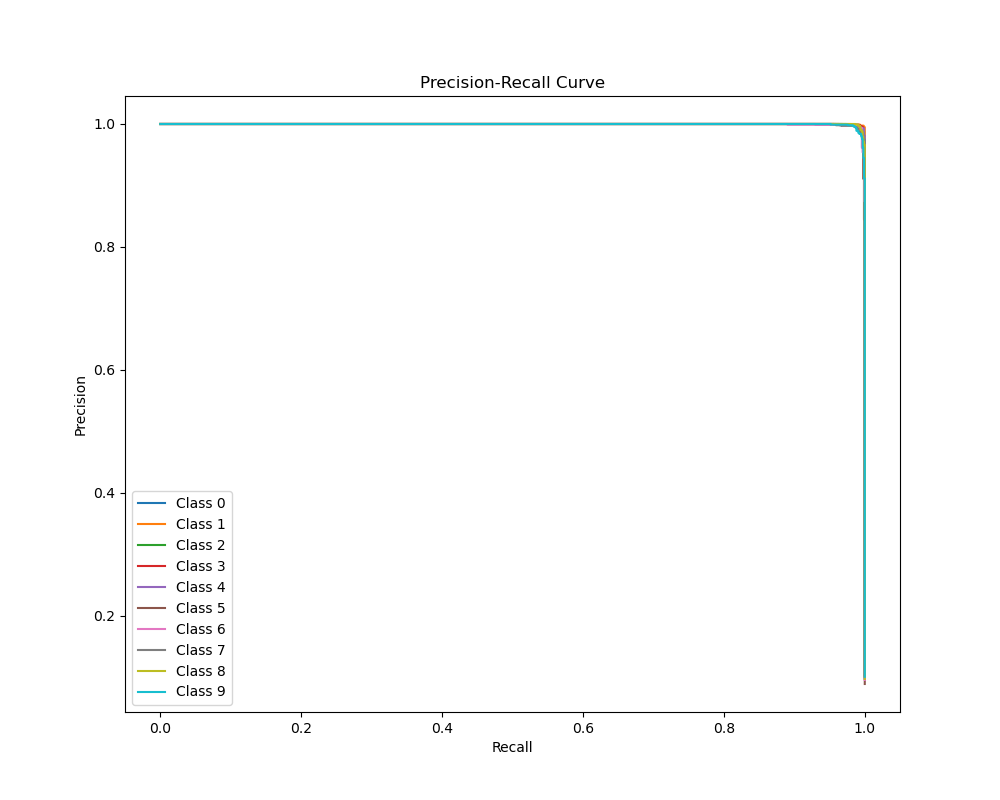

# CV_DEMO

本仓库用于存储一些计算机视觉相关的DEMO

> TODO LIST
>
> 1. **经典分类任务**：MNIST（手写数字）、CIFAR-10（10类物体）
> 2. **自动驾驶场景**：车牌识别、BDD100K（驾驶视频）、KITTI（3D点云+图像）

## 手写数字MNIST

+ **项目概述**：本项目是一个基于 PyTorch 的 MNIST 手写数字分类任务，包括模型训练和模型评测两个主要模块。通过卷积神经网络CNN对 MNIST 数据集进行分类，并提供了丰富的评测指标和可视化结果。

+ **数据集**：MNIST 手写数字数据集（28x28 灰度图像，10 个类别）。

+ **数据预处理**：简单地转换为张量并归一化。

+ **模型选型**：CNN 模型（1 通道；2 层卷积 + ReLU 激活 + 最大池化；2 层全连接 + Dropout）

+ **训练流程**

  + **优化器**：Adam。
  + **损失函数**：交叉熵损失（nn.CrossEntropyLoss）。
  + **学习率调整**：ReduceLROnPlateau，基于验证集准确率动态调整学习率。
  + **早停机制**：如果验证集准确率连续多个 epoch 未提升，则提前停止训练。
  + **模型保存**：每个 epoch 保存最新模型，保存验证集准确率最高的模型。

+ **评测指标**

  + **分类报告**：精确率（Precision）、召回率（Recall）、F1 分数。

    ```txt
              precision    recall  f1-score   support
    
           0       1.00      0.99      1.00       980
           1       1.00      1.00      1.00      1135
           2       0.99      0.99      0.99      1032
           3       0.99      1.00      1.00      1010
           4       0.99      1.00      0.99       982
           5       0.99      0.99      0.99       892
           6       1.00      0.99      0.99       958
           7       0.99      0.99      0.99      1028
           8       1.00      0.99      0.99       974
           9       0.99      0.99      0.99      1009
    
    accuracy                           0.99     10000
    
    macro avg      0.99      0.99      0.99     10000
    weighted avg   0.99      0.99      0.99     10000
    ```

  + **混淆矩阵**：展示模型在每个类别上的分类情况。

    

  + **ROC 曲线**：展示模型在多分类任务中的性能。

    

  + **PR 曲线**：展示精确率与召回率的关系。

    

## 车牌识别LPR

+ **数据集**：[CCPD2020](https://github.com/detectRecog/CCPD?tab=readme-ov-file)，仅包含新能源浅绿车牌相关数据，能很好反映近年来新能源的强势崛起。
+ **参考文献**
  1. [数据集来源论文](https://link.springer.com/chapter/10.1007/978-3-030-01261-8_16)
+ （弃用）[数据集来源论文关于不同子数据集的描述](https://link.springer.com/chapter/10.1007/978-3-030-01261-8_16/tables/3)
  + 本项目采用YOLO11，通过改进的检测头和多尺度特征融合，对倾斜、模糊等场景有较强的鲁棒性，无需严格进行划分子数据集。
+ **数据预处理**
  1. CCPD2020数据集直接将标注信息嵌入到图像的文件名中，其中共包含七个部分，本项目只使用其中的①车牌号码和②车牌四顶点坐标。